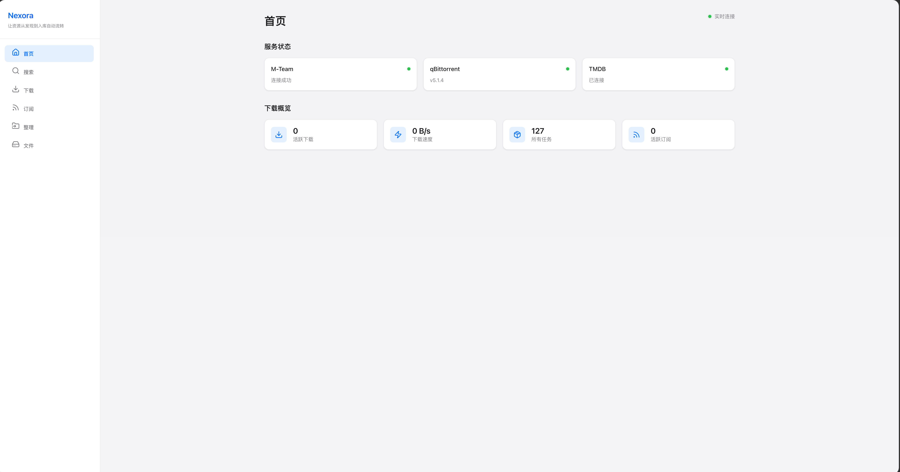
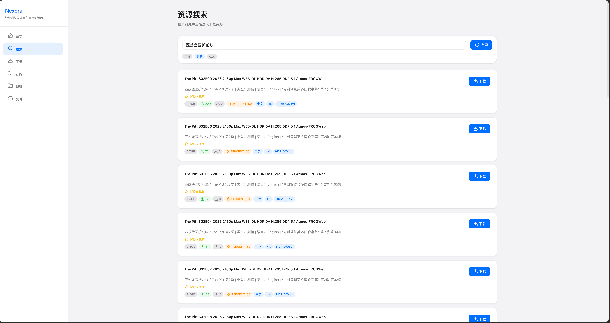
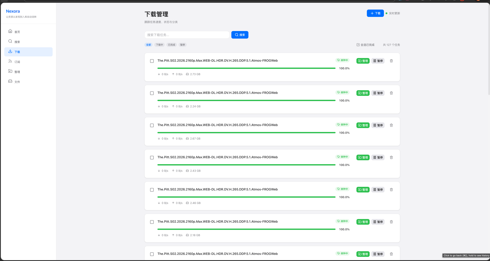
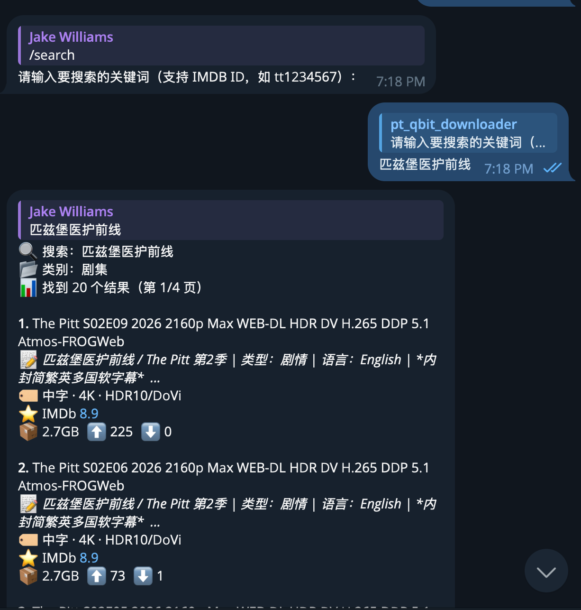
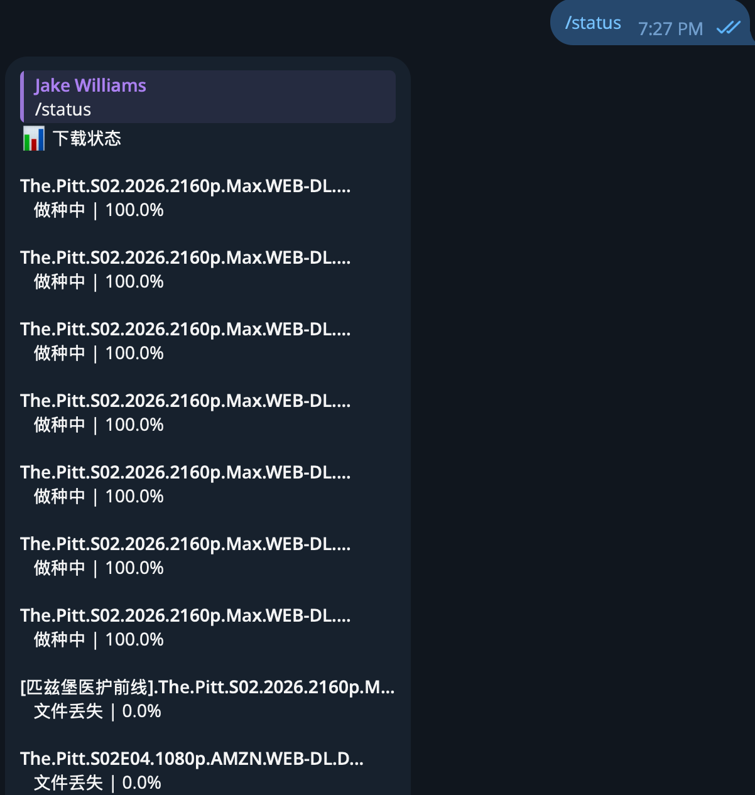
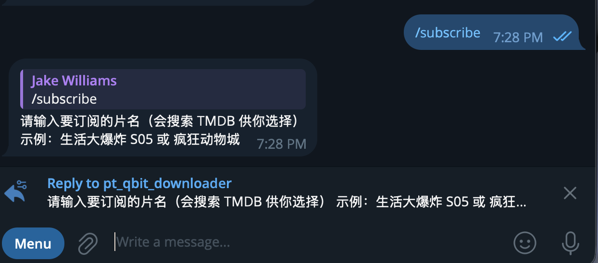

# Nexora

一站式私人影视库管理工具 —— 搜索资源、自动下载、整理入库，全程可视化操作。

Nexora 帮你把 M-Team 资源搜索、qBittorrent 下载、媒体库整理串成一条自动化流水线。你可以通过 **Web 界面** 或 **Telegram Bot** 随时随地操作，也可以设置订阅让系统自动追更。

---

## 它能做什么

- **搜索资源** — 输入片名，按电影/剧集分类搜索 M-Team，一键下载
- **管理下载** — 实时查看下载进度、暂停/恢复/删除任务
- **自动整理** — 下载完成后自动重命名并归档到你的媒体库（Emby / Jellyfin / Kodi 直接识别）
- **刮削封面** — 自动从 TMDB 获取海报、简介、评分，生成 NFO 元数据文件
- **订阅追更** — 订阅一部剧，系统自动轮询下载新集，完结自动停止
- **双端操作** — Web 界面 + Telegram Bot，电脑手机都能用

---

## 界面预览

### Web 界面

<!-- 请将截图放在 docs/screenshots/ 目录下 -->

| 首页（搜索 + 热门推荐） | 搜索结果 | 下载管理 |
|:---:|:---:|:---:|
|  |  |  |

### Telegram Bot

| 搜索资源 | 选择下载 | 订阅管理 |
|:---:|:---:|:---:|
|  |  |  |

---

## 快速开始

### 你需要准备

| 项目 | 说明 | 是否必须 |
|------|------|:--------:|
| Telegram Bot Token | 通过 [@BotFather](https://t.me/BotFather) 创建 Bot 获取 | 必须 |
| M-Team API Key | M-Team 网站 → 控制面板 → 实验室 获取 | 必须 |
| qBittorrent | 需开启 Web UI（默认端口 8080） | 必须 |
| TMDB API Key | [申请地址](https://www.themoviedb.org/settings/api)，用于获取海报和影片信息 | 推荐 |
| Docker | 容器化部署（推荐） | 推荐 |

### 三步启动

**第 1 步：下载项目**

```bash
git clone https://github.com/aapw01/Nexora-pt-helper.git
cd Nexora-pt-helper
```

**第 2 步：编辑配置**

```bash
cp config.example.yaml config.yaml
```

打开 `config.yaml`，填入你的 Telegram Token、M-Team API Key、qBittorrent 地址等信息（详见下方配置说明）。

**第 3 步：启动服务**

```bash
# Docker 部署（推荐）
docker-compose up -d

# 或者本地运行（需要安装 uv）
uv sync && uv run python main.py
```

启动后：
- 打开浏览器访问 `http://你的IP:8000` 即可使用 Web 界面
- 在 Telegram 中找到你的 Bot，发送 `/help` 开始使用

---

## 配置说明

配置文件是 `config.yaml`，从 `config.example.yaml` 复制后修改。

### 必填配置

```yaml
telegram:
  token: "你的 Bot Token"       # 从 @BotFather 获取
  chat_id: ""                   # 留空则所有人可用，填入 Chat ID 则仅限指定用户

mteam:
  api_key: "你的 API Key"       # M-Team 控制面板获取
  domain: "m-team.io"

qbittorrent:
  host: "http://192.168.1.100"  # qBittorrent 地址（Docker 部署时不能写 localhost）
  port: 8080
  username: "admin"
  password: "你的密码"
```

### 推荐配置：TMDB 刮削

填入后系统会自动获取海报、简介并生成元数据文件，你的 Emby/Jellyfin 可以直接识别。

```yaml
organize:
  enabled: true
  tmdb:
    api_key: "你的 TMDB API Key"
    language: "zh-CN"
```

### 推荐配置：资源整理

下载完成后自动重命名并归档到媒体库目录。

```yaml
organize:
  enabled: true
  mode: "manual"                # auto=自动整理 / manual=手动触发 / both=都启用
  libraries:
    movie: "/media/Movies"      # 电影存放目录
    tv: "/media/TV"             # 剧集存放目录
```

> 首次使用建议先设置 `dry_run: true`，系统只会输出日志不实际移动文件，确认路径无误后再关闭。

### Docker 挂载目录说明

`docker-compose.yml` 中需要把你的下载目录和媒体库目录挂载到容器内：

```yaml
volumes:
  - ./config.yaml:/app/config/config.yaml:ro   # 配置文件
  - ./data:/app/data                           # 数据库等持久化数据
  - /你的下载目录:/downloads                     # qBittorrent 下载目录
  - /你的媒体库目录:/media                       # 整理后的媒体库目录
```

完整配置项参考 [`config.example.yaml`](config.example.yaml)。

---

## 使用指南

### Web 界面

- **搜索**：在首页输入片名，选择电影/剧集分类，点击搜索
- **下载**：搜索结果中点击"下载"按钮，可选择 qBittorrent 分类目录
- **下载管理**：查看正在下载的任务，支持暂停/恢复/删除
- **文件整理**：浏览下载目录，选择文件手动整理到媒体库
- **订阅**：添加剧集订阅，系统自动检查并下载新集

### Telegram Bot

在 Telegram 中与 Bot 对话，常用命令：

| 命令 | 说明 |
|------|------|
| `搜索 关键词` 或 `/search 关键词` | 搜索资源 |
| `/status` | 查看下载状态 |
| `/organize` | 手动整理已完成的下载 |
| `/subscribe` | 添加订阅（支持带季号，如 `行尸走肉 S05`） |
| `/subs` | 查看和管理订阅 |
| `/help` | 显示帮助 |

### 订阅自动追更

1. 发送 `/subscribe 片名`
2. 选择"电视剧"或"电影"
3. 从搜索结果中确认
4. 系统每 30 分钟自动检查 M-Team 是否有新资源
5. 有新集自动下载，全部下完自动标记"已完成"

---

## 常见问题

**Q: Docker 部署后 Web 界面打不开？**
检查端口映射是否正确（默认 `8000:80`），以及防火墙是否放行。

**Q: 搜索正常但下载失败？**
确认 qBittorrent 的 Web UI 地址填写正确。Docker 部署时不能写 `localhost`，需要写宿主机 IP 或 Docker 网关地址（通常是 `172.17.0.1`）。

**Q: 整理后 Emby/Jellyfin 没有识别到新文件？**
确认 `libraries` 目录配置正确，并且容器内能访问到该目录。首次使用建议开启 `dry_run: true` 测试。

**Q: 如何更新到最新版本？**
```bash
docker-compose pull && docker-compose up -d
```
或从源码构建：
```bash
git pull && docker-compose up -d --build
```

---

## 许可证

MIT License
